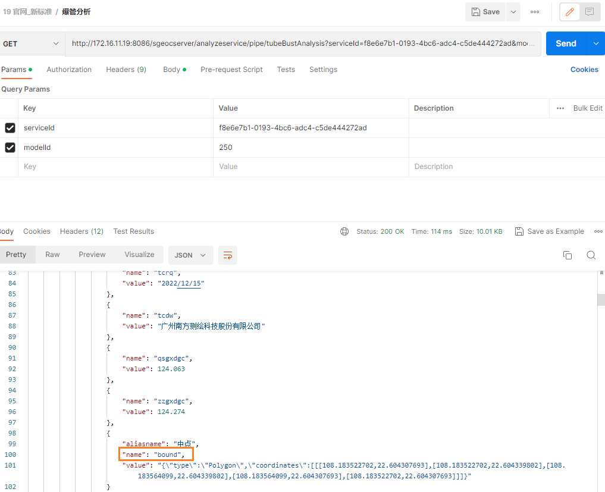
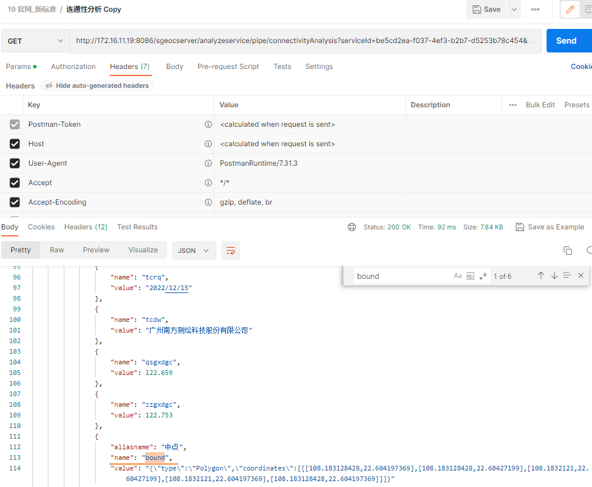
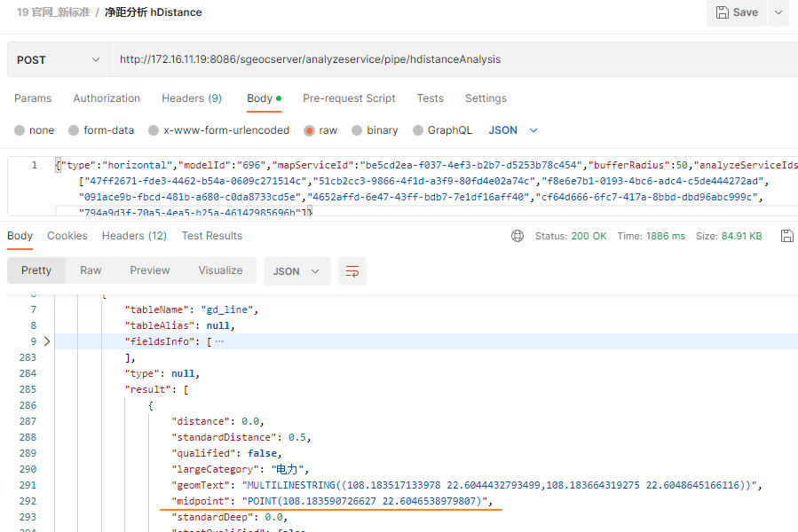
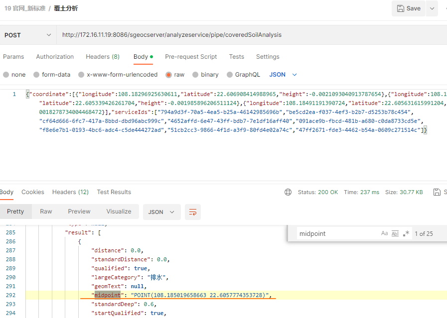
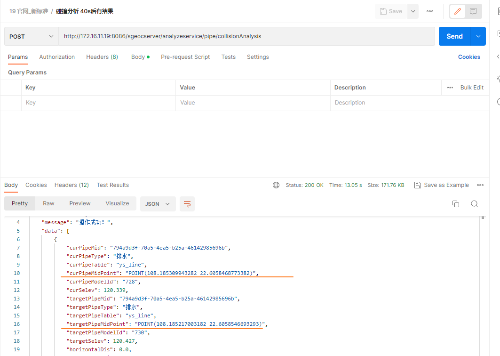

### 定位分析

1. 后台结果中的 `bound`定位: 爆管分析, 连通性分析

   

   

2. 后台结果中的 `midpoint`定位: 净距分析, 覆土分析

   

   

3. 后台结果中的 `curPipeMidPoint`或`targetPipeMidPoint`定位: 碰撞分析

   

   

### [openai-translator](https://github.com/yetone/openai-translator/blob/v0.0.34/README-CN.md)

如何解决调用API需要收费的问题

| **Model**     | **Usage**          |
| ------------- | ------------------ |
| gpt-3.5-turbo | $0.002 / 1K tokens |