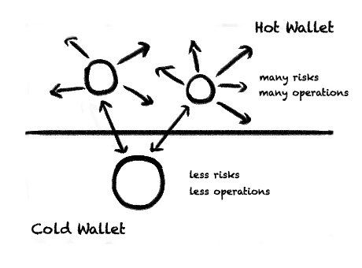

[toc]

### 两点通用的安全建议

###### 分散资产，规划好钱包用途

- 日常高频使用的热钱包存放少量资产，不同的钱包使用不同的助记词创建。
- 设置冷钱包，用于储蓄和转账，减少交互和使用。
- 周期性的创建新钱包进行资产转移。

很多资深人士的做法是将资产放入硬件钱包，每次需要对外交互的时候，都重新创建一个新钱包，用完即废弃。

###### 警惕任何看到的消息

- 学会正确的寻找官方网站、公告、项目等，不从第三方网站下载安装软件
- 看到信息需要多加思考。即便是官方发布的消息，有时候也可能是因为官方账号被黑导致的

再次提醒：由于 Web3 分布式和匿名的特性，一旦资产被盗，将很难追回，请务必注意安全问题！
如果想要了解更多安全知识，推荐 [区块链黑暗森林自救手册](https://github.com/slowmist/Blockchain-dark-forest-selfguard-handbook)、[Web3 生存指南之防骗反诈安全手册V1.0](https://e7qjl676i8.feishu.cn/docs/doccn2rvEMHefBYKvyTVRGwe7Pf#)。

### [区块链黑暗森林自救手册](https://tinyurl.com/y7z3wkfa)