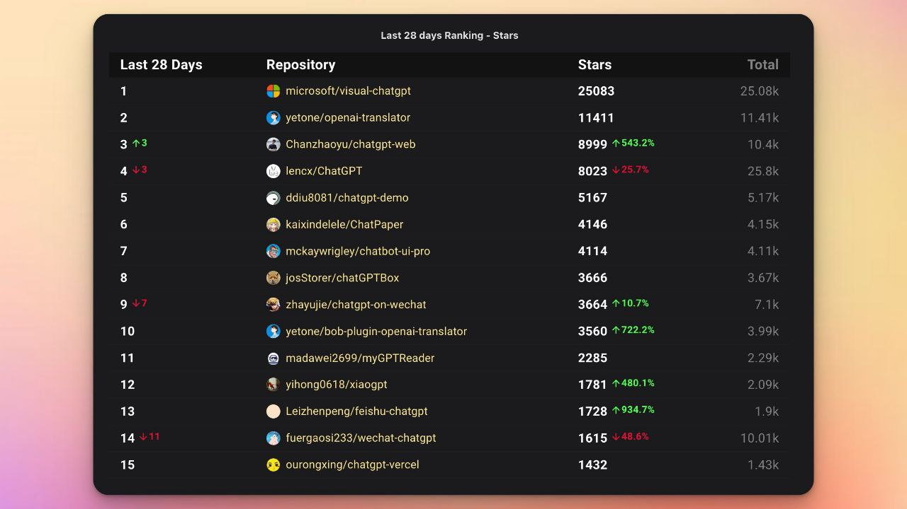
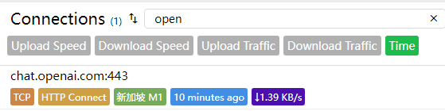

[toc]

### OpenAI 

为什么 IP 很重要？因为 [Stripe](https://stripe.com/zh-cn-sg) 有个工具叫做 [Stripe Radar](https://stripe.com/zh-cn-sg/radar) 

理论上接受VISA，万事达，美国运通，JCB，Discover等来自所有大型银行卡品牌的信用卡和借记卡

OpenAI可以选择拒绝来自哪些国家和地区的信用卡和借记卡付款，也可以通过一些要素来识别不安全的支付，例如： IP 欺诈和使用代理的问题。

### ChatGPT相关热门项目排行-按star排序

### ChatGPT 一直断线解决方案

https://github.com/lencx/ChatGPT/discussions/133#discussioncomment-5117766

### [减少 ChatGPT 官方网页需要频繁刷新的简单办法 - V2EX](https://www.v2ex.com/t/926890#reply45)

> 油猴脚本

是否保持连接可以从cfw中的connections中查看

### NFT 

原本 NFT 吧其实就是个图片，如果将图片设置为头像是完全可以的，Facebook 和 Twitter 是连接 **OpenSea** 等平台，授权账号的 NFT 藏品后，再将藏品设置为头像，本质上还是个图片。

NFT 的泡沫迅速被戳破，现在连 Meta 也宣布放弃支持 NFT 

[还有个顶级冤大头是高价购买杰克多西首条推文的 NFT](https://www.landiannews.com/archives/94320.html)，当时推特创始人杰克多西将推特的第一条推文铸造为 NFT，加密货币企业家 Sina Estavi 花费 290 万美元购买了这个 NFT，结果后面 NFT 泡沫被戳破后这个 NFT 在公开拍卖中仅获得 29 美元的价格。