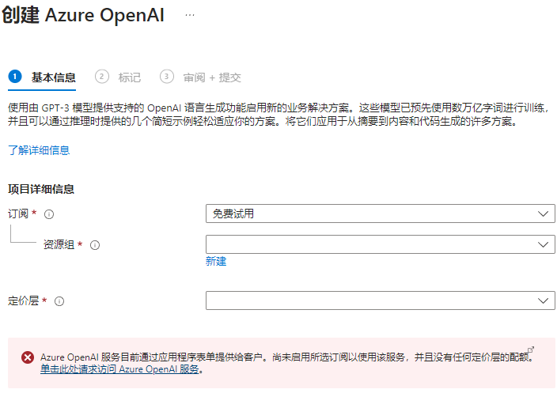

### Vue Api [toRef](https://github.com/vuejs/core/pull/7997)

TL;DR

- One API for normalizing difference sources (value / ref / getter) to values (by introducing `toValue()`)
- One API for normalizing different sources (value / ref / getter) **to refs** (by enhancing `toRef()`)
- Introduce `MaybeRef<T>` and `MaybeRefOrGetter<T>` types

[source code](https://tinyurl.com/5cpkyvw7)

```ts
export function toRef(
  source: Record<string, any> | MaybeRef,
  key?: string,
  defaultValue?: unknown
): Ref {
  if (isRef(source)) {
    return source
  } else if (isFunction(source)) {
    return new GetterRefImpl(source as () => unknown) as any
  } else if (isObject(source) && arguments.length > 1) {
    return propertyToRef(source, key!, defaultValue)
  } else {
    return ref(source)
  }
}
```


###  [#Azure](https://twitter.com/hashtag/Azure?src=hashtag_click) OpenAI Service



目前，仅应用程序授予对此服务的访问权限。 可以通过在 [https://aka.ms/oai/access](https://aka.ms/oai/access?azure-portal=true) 上填写表单来申请对 Azure OpenAI 的访问权限。

[#](https://twitter.com/zhangjintao9020/status/1641688163587588099?s=20) [#](https://twitter.com/zhangjintao9020/status/1638845039068737537) [#](https://twitter.com/oran_ge/status/1642137081454665730) [#](https://twitter.com/KittenYang/status/1636316876853891074)

提交了两份审查

> 020-23380888
>
> **510620**
>
> https://www.southsmart.com
>
> 订阅id: ea0884e6-1e03-4a98-9ad2-7f6d1dfbb179
>
> *目录id: dcaa555f-9afe-4761-839d-3948c8174ced
>
> 广州南方智能技术有限公司 - 思成路39号

[如何使用Azure Openai](https://tinyurl.com/39hs8vxh) 

> 注册 **Azure** 中国区并白嫖200美刀的 ChatGPT API，可以参见这个教程，步骤多了点，但亲测过程还是比较顺利的，中国区+个人身份+一个域名邮箱即可。 注册完需要等几天才可以用，但白嫖就不怕等待。

[微软Azure云openai详细api注册申请](https://www.sunpop.cn/chatgpt_in_china_with_azure_openai_api_free_1_year_odoo/)

上午申请下午4点就收到验证邮箱;

**申请是不是要 Azure的邮箱.订阅id.问卷邮箱保持一致?**

> 取消订阅: 主页 ->成本管理+计费->付款方式  | 订阅 -> 取消订阅 (禁用 + 删除)

删除卡片有点麻烦.. 3天后才能删除订阅&付款方式
