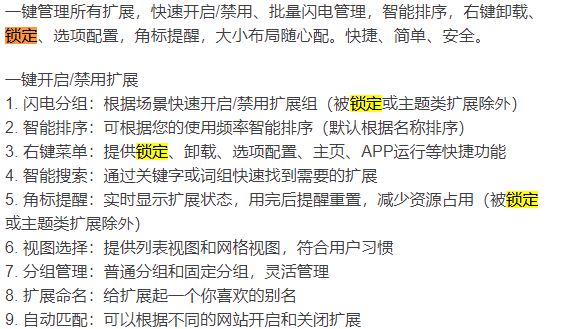

### [chatgpt-i18n](https://chatgpt-i18n.vercel.app/)

### [ShareGPT](https://sharegpt.com/)

### [FreedomGPT](https://freedomgpt.com/)

### [简单登录 |开源匿名电子邮件服务 (simplelogin.io)](https://simplelogin.io/)

提供真实邮箱的别名，可以接收和回复邮件，所有邮件都会转到你的真实邮箱

### nvm 更新

> nvm 1.1.7 + npm v8.3.1 有bug https://github.com/npm/cli/issues/4234

windows需要使用`nvm-windows` 提供的`.exe` 更新

https://github.com/coreybutler/nvm-windows/releases

更新nvm, 下载最新的node, 同步之前的全局依赖

### Extension Manager 分组策略

- 固定分组下的扩展将会一直保持开启状态，您可以将常用扩展加入分组。

- 通过分组闪电管理扩展状态，适配不同场景，比如家、公司。

锁定状态:

