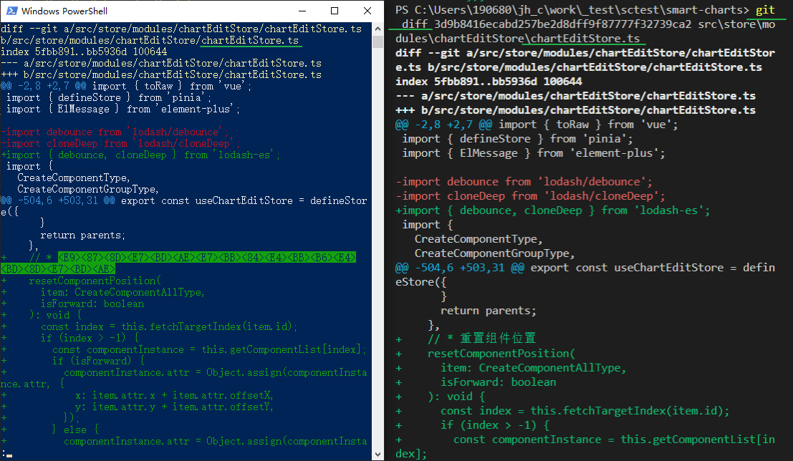

### Vue 的 getCurrentInstance() 在哪个版本中返回null, 又在哪个版本中被 移除了


在Vue.js 3.0版本中，如果在setup()函数之外调用getCurrentInstance()函数，它将返回null。这是因为Vue 3.0的架构发生了重大变化，setup()函数成为了组件的入口点，Vue不再像Vue 2.x那样提供全局API。

至于Vue.js中getCurrentInstance()函数被移除的情况，事实上它没有被移除，而是被重命名为了getCurrentVM()函数。这个改变发生在Vue.js 3.2.0版本中。在这个版本之前，getCurrentInstance()函数也可以使用，但它被标记为过时（deprecated）。

需要注意的是，在Vue.js 3.2.0版本之后，使用getCurrentInstance()函数将会抛出错误。如果您需要访问组件实例，请改用getCurrentVM()函数。


### git 如何让当前的文件与某个提交进行对比的命令


要比较当前的文件与某个提交（commit）的差异，可以使用以下 Git 命令：

```
git diff <commit> <file>
```

其中，`<commit>` 表示某个提交的标识符，可以是提交的 SHA-1 值、分支名或者标签名等。`<file>` 表示要比较的文件名，可以使用相对或绝对路径指定。

例如，要比较当前文件夹下的 `index.html` 文件与最近一次提交（HEAD）之间的差异，可以使用以下命令：

```
git diff HEAD index.html
```

如果要比较某个提交之间的差异，可以使用提交的 SHA-1 值或者标签名来指定：

```
git diff a1b2c3d4 e5f6g7h8 file.txt
```

这个命令将比较 `a1b2c3d4` 和 `e5f6g7h8` 两个提交之间的 `file.txt` 文件的差异。

需要注意的是，如果没有指定文件名，则 `git diff` 命令将比较工作目录中所有文件与指定提交之间的差异。如果需要比较两个提交之间的所有差异，可以省略文件名参数


#### git diff后不能完整显示内容


如果在使用 `git diff` 命令查看修改内容时，发现内容不能完整显示，可能是因为 Git 使用了默认的分页器来显示内容，而分页器的高度比终端窗口的高度低，导致内容被截断。在这种情况下，可以按照以下方法来解决：

1. 按下空格键或者 `Page Down` 键来滚动到下一页。这样可以查看到被截断的内容。

2. 使用 `git diff` 命令的 `--no-pager` 选项来禁用分页器，从而可以在终端窗口中直接查看完整的修改内容。例如：

   ```
   git --no-pager diff
   ```

3. 通过设置 Git 的配置来调整分页器的高度。可以使用以下命令来设置分页器的高度为 100 行：

   ```
   git config --global core.pager "less -F -X -S -R -#100%"
   ```

   这个命令将配置 Git 使用 `less` 命令作为分页器，并将分页器的高度设置为终端窗口的高度。`-F` 选项会禁用分页器的滚动条，`-X` 选项会禁用分页器的清屏功能，`-S` 选项会禁用分页器的折行功能，`-R` 选项会启用分页器的 ANSI 颜色支持，`-#100%` 选项会将分页器的高度设置为终端窗口的高度。

