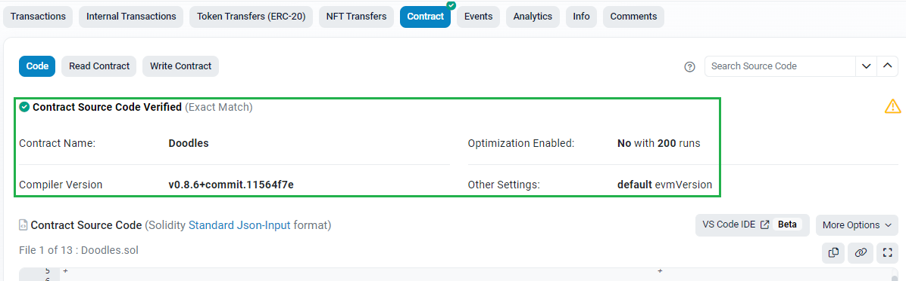

[toc]

### 如何在一个js模块中定义一个变量variable, 值类型为对象,给其他模块(a和b模块)引用, 但是a会改动到variable的值, 这样也会改动到b模块, 该怎么处理

`import`命令输入的变量都是只读的，因为它的本质是输入接口。也就是说，不允许在加载模块的脚本里面，改写接口。

```javascript
import {a} from './xxx.js'

a = {}; // Syntax Error : 'a' is read-only;
```

上面代码中，脚本加载了变量`a`，对其重新赋值就会报错，因为`a`是一个只读的接口。但是，如果`a`是一个对象，改写`a`的属性是允许的。

```javascript
import {a} from './xxx.js'

a.foo = 'hello'; // 合法操作
```

上面代码中，`a`的属性可以成功改写，并且其他模块也可以读到改写后的值。


### 以太坊合约源码查询

> https://tinyurl.com/nvk4dw96
>
> 0x8a90CAb2b38dba80c64b7734e58Ee1dB38B8992e




### Solidity合约示例

以下是一个简单的Solidity合约示例，它实现了一个简单的计数器：

```
csharpCopy codepragma solidity ^0.8.0;

contract Counter {
    uint256 private count = 0;

    function getCount() public view returns (uint256) {
        return count;
    }

    function incrementCount() public {
        count += 1;
    }

    function decrementCount() public {
        count -= 1;
    }
}
```

这个合约定义了一个名为`Counter`的合约，并包含三个函数：`getCount`，`incrementCount`和`decrementCount`。其中，`getCount`是一个只读函数，返回当前计数器的值；`incrementCount`和`decrementCount`分别增加和减少计数器的值。

这个合约使用Solidity语言编写，并且包含一个状态变量`count`，用于存储计数器的值。`private`关键字表示该状态变量只能在合约内部使用，外部无法访问。

如果您想进一步了解Solidity合约编写，可以参考Solidity官方文档：https://solidity.readthedocs.io/en/latest/


### [三环样式](https://codepen.io/jiang-24-gdufs/pen/vYVxQqw)

