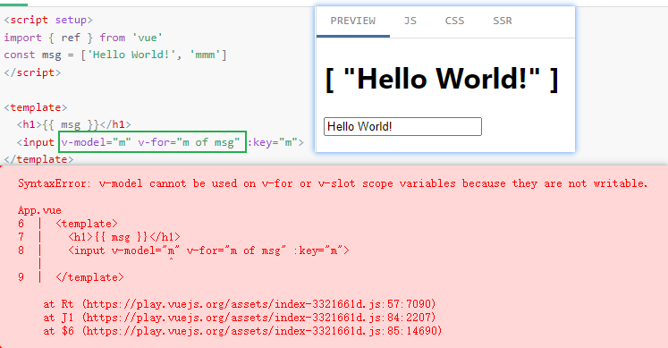

### 

经验表明，解决一个棘手难题的最有效方式往往是，在别的地方得到很大的收益，然后就不在乎并且可以放弃原来那个棘手难题了。

因为彻底放弃的损失，远远低于你在新的地方的收益。 而问题之所以棘手，不是因为你不够聪明，本质就是因为太多各种瓶颈的硬性约束，根本没有可以接受的解决方案。

> 本质不是大多数人都有损失厌恶的同时又不知道其他地方有确定性的高收益吗？ 举个例子，你投资A已经浮亏50%，大多数人希望起码回本再出，如果他能确定投资B立马回本甚至开始赚钱，他会不会赶紧出了A去买B？ 损失厌恶+太多的不确定性才是大多数人不愿意放弃既有损失的根本原因。

### Vue `v-for` + `v-model` 报错

