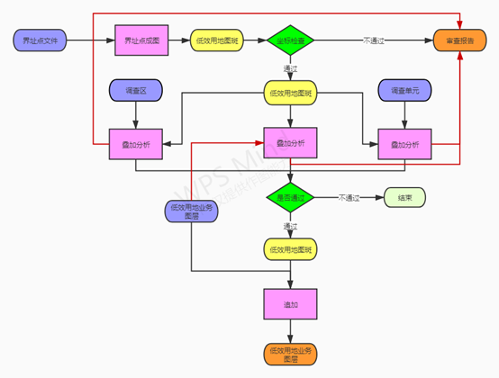
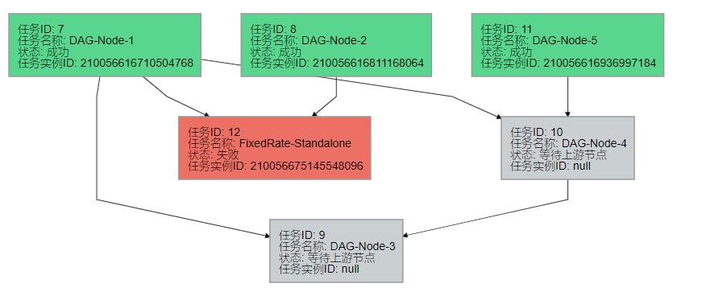
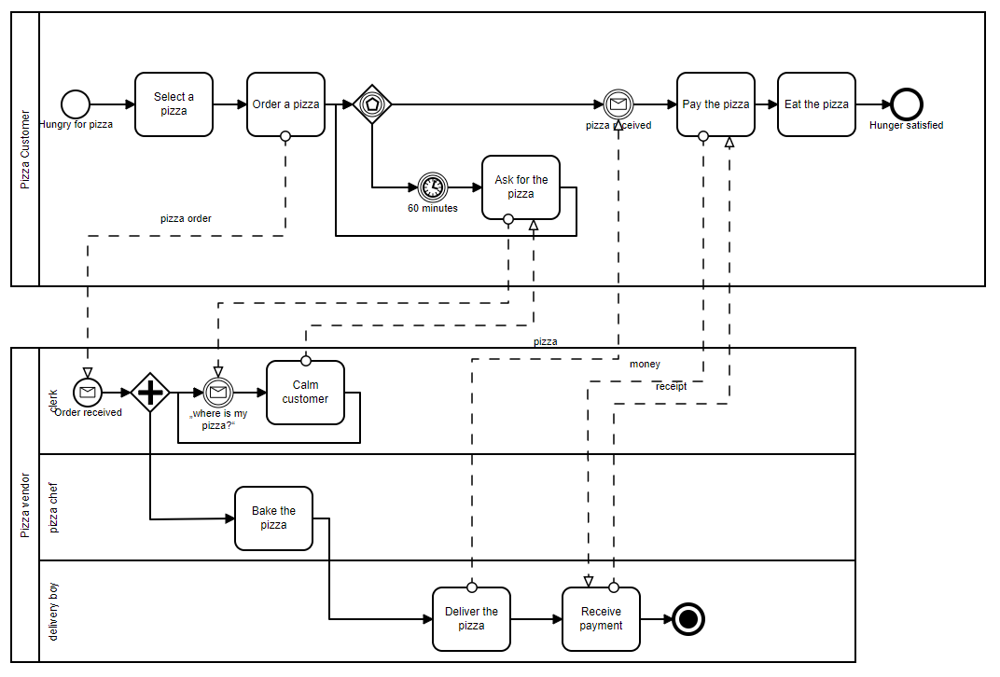
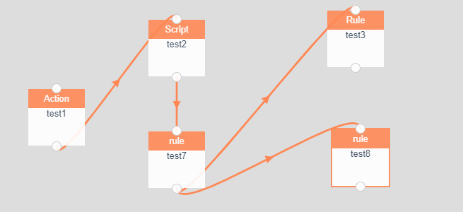

# 工作流程设计组件调研

### 需求: 

需求解析:

输出一个流程设计图, 需要支持以下功能

 1. 条件分支判断
 2. 并行/串行
 3. 任务状态

算法结果的输出, 含中间结果和最后结果

### 工作难点:

- 整体难点
  - 条件分支的控制
  - 线的并行/串行控制
  - 中间数据暂存和暂存数据的清除
  - 失败任务重跑的处理方式
    - 从头开始运行
    - 修改中间数据后从最近的一次任务继续执行
    - 其他异常情况
- 联调难点 [前端采用bpmn插件]
  - bpmn输出xml文件, 后台需要坐解析转换为PowerJob支持的数据格式
  - bpmn画布为手动添加一个初始节点, 之后会转化为导入节点的方式, 需要同步节点信息
  - 依据各个任务状态为节点赋色, 标记流程线进度

### 考虑的使用组件库:

1. dagre-d3 [开源PowerJob自带]

   - 优点: 依据数据自动布局, 前后端只需要统一数据, 不需要保存其表现数据

   - 缺点:  自动布局后的连线会比较乱，而且连线不是横平竖直的, 复杂的流程图的连线混乱不清; 不可编辑节点内容; 无逻辑处理

   - 效果图: 

     

2. bpmn [体验地址](https://demo.bpmn.io/new)

   一个流程图设计生产svg可视化图形工具库

   - 优点: 节点类型丰富, 可自定义编辑节点内容, 支持定义边界条件; 支持导入导出bpmn文件;

   - 缺点: 使用门槛相对较高; **输出数据为bpmn, 没有节点内容和矢量线相关的信息, 与现有接口不符;**  前端展示保存完毕的设计图需要使用svg/bpmn, 需要后台协助保存;

   - 其他: 支持定义边界条件功能需要额外设置一套规则并解析;

   - 效果图: 

     

3. vue-simple-flowchart [体验地址](https://jeffreyrn.github.io/vue-simple-flowchart/demo/)

   一个轻量级流程图编辑器

   - 优点: 节点自带输入/输出口操作简单; 节点之间的矢量线是鼠标拖拽操作; 输出结果与接口所需数据字段类似;

   - 缺点: 节点多连线多也避免不了混乱的问题; 为了前后展示效果一致, 后台协助保存相关的节点位置信息;  不可编辑节点内容; 无逻辑处理

   - 其他: 可以通过鼠标交互实现更多提示/查看/编辑功能;

   - 效果图: 

     

| 个人评价[0到5分]     | 开发难度 | 可拓展性 | 美观性 |
| -------------------- | -------- | -------- | ------ |
| dagre-d3             | 0        | 0        | 1      |
| bpmn                 | 5        | 2        | 4      |
| vue-simple-flowchart | 2        | 3        | 3      |

暂定: 从效果和功能性考虑大概率会基于bpmn这个库来拓展实现该需求